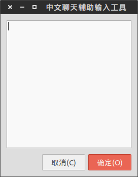

input-box
=========

适用性更广的中文输入辅助工具，专为支持调用中文输入的程序([Telegram](https://github.com/telegramdesktop/tdesktop),Sublime-Text etc.)配合。
#依赖库

+ xclip
+ xdotool
+ perl
+ zenity

PS: 以上库Ubuntu都默认安装了
#使用步骤

1. 给脚本设置热键  

2. 鼠标点击激活你要输入的地方
3. 使用热键调出一个中文输入框  

4. 当你按确定的时候，你的输入内容已经发出

PS: 本程序最新版受[minecraft-chat-helper](https://github.com/m13253/minecraft-chat-helper)启发，但适用于所有可输入的程序。
