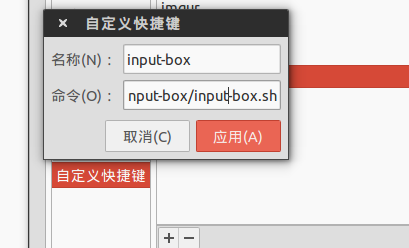

input-box
=========

This tool can help user to type East Asian languages to the apps ([Telegram](https://github.com/telegramdesktop/tdesktop),Sublime-Text etc.) which don't support input methods.

#Dependencies

+ xclip
+ xdotool
+ perl
+ gedit

#Usage

1. Put the script wherever you want.
2. Assign a keyboard shortcut to run the script. 

3. Now you press hotkey the hotkey to open gedit and type some words in it,press hotkey again to close gedit and these words will automatically appear in your clipboard.
4. Enjoy it !
